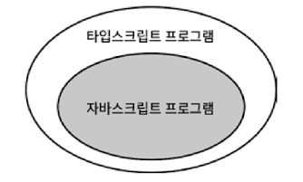

# 아이템 1 타입스크립트와 자바스크립트의 관계 이해하기

# “타입스크립트는 자바스크립트의 상위 집합(superset)이다”



- 자바스크립트는 `.js` 또는 `.jsx` 확장자를 쓰며, 타입스크립트는 `.ts` 또는 `.tsx` 확장자를 쓴다
- 타입스크립트는 자바스크립트의 상위집합이기 때문에 `.js` 파일에 있는 코드는 이미 타입스크립트라고 할 수 있다.
(main.js 파일을 main.ts 로 바꾼다고 해서 달라지는 것은 없음)
    
    ⇒ 이로 인해 js 파일을 ts 파일로 마이그레이션(migration)하는 데 엄청난 이점이 됨
    기존 코드를 그대로 유지하면서 일부분에만 타입스크립트 적용이 가능하기 때문
    
- 모든 자바스크립트 프로그램은 타입스크립트다. → 참
모든 타입스크립트 프로그램은 자바스크립트다. → 거짓
타입스크립트는 타입을 명시하는 추가적인 문법을 가지기 때문
- 타입스크립트는 런타임에 오류를 발생시킬 코드를 미리 찾아낸다.
타입 체커가 모든 오류를 찾아내지는 않지만, 타입 구문을 추가함으로써 훨씬 더 많은 오류를 찾아낼 수 있다.

# 타입 체커를 통과한 타입스크립트 프로그램


“타입스크립트는 자바스크립트의 상위 집합이다"라는 문장이 잘못된 것처럼 느껴진다면, 아마도 “타입 체커를 통과한 타입스크립트 프로그램" 영역 때문일 것이다.
이는 평소 타입스크립트 코드를 작성할 때 타입 체크에서 오류가 발생하지 않도록 신경을 쓰며 타입스크립트 코드를 작성하기 때문이다.

### **타입스크립트의 타입 시스템은 자바스크립트의 런타임 동작을 ‘모델링'한다**

---

정상 동작 예시

```tsx
const x = 2 + '3' // 정상, string 타입
const y = '2' + 3 // 정상, string 타입
```

위의 코드는 타입스크립트의 타입 체커가 정상으로 인식한다. 둘다 문자열 “23”이 되는 자바스크립트 런타임 동작으로 모델링된다.

에러 발생 예시

```tsx
const a = null + 7 // 자바스크립트에서는 a 값이 7이 된다.
const b = [] + 12 // 자바스크립트에서는 b 값이 12가 된다.
alert('Hello', 'TypeScript') // 자바스크립트에서는 "Hello" 경고를 표시한다.
```

자바스크립트의 런타임 동작을 모델링하는 것은 타입스크립트 타입 시스템의 기본 원칙이.
그러나 단순히 런타임 동작을 모델링하는 것 뿐만 아니라, 의도치 않은 이상한 코드가 오류로 이어질 수도 있다는 점까지 고려해야 한다.