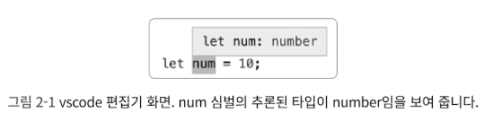

# 아이템 6 편집기를 사용하여 타입 시스템 확인하기

타입스크립트 설치시 실행 가능한 두 가지

- 타입스크립트 컴파일러(tsc)
- 단독으로 실행할 수 있는 타입스크립트 서버(tsserver)

보통 타입스크립트 컴파일러를 실행하는 것이 주 목적이지만, 타입스크립트 서버 또한 ‘언어 서비스'를 제공한다는 점에서 중요하다.
언어서비스는 코드 자동 완성, 명세(사양) 검사, 검색, 리팩토링이 포함된다.
보통은 편집기를 통해서 언어 서비스를 사용하지만 타입스크립트 서버에서 언어 서비스를 제공하도록 설정하는 게 좋다.




편집기마다 조금씩 다르지만, 보통의 경우 심벌 위에 마우스 커서를 대서 타입스크립트가 그 타입을 어떻게 판단하는지 알 수 있다.

**주의할 점은, 추론된 타입이 의도한 타입과 다르다면 타입 선언을 직접 명시하고, 실제 문제가 발생하는 부분을 찾아봐야 한다.**

특정 시점에 타입스크립트가 값의 타입을 어떻게 이해하고 있는지 살펴보는 것은 타입 넓히기와 조빟기의 개념을 잡기 위해 꼭 필요하다.
조건문의 분기에서 값의 타입 시스템을 연마하는 매우 좋은 방법이.


**또한 언어 서비스는 라이브러리와 라이브러리의 타입 선언을 탐색할 때도 도움이 된다.**


‘Go to Definition’ 기능을 통해 함수나 다른 다양한 타입 정의를 알아볼 수 있다.

```tsx
declare function fetch(
	input: RequestInfo, init?: RequestInit
): Promise<Response>
```

fetch 가 Promise 를 반환하고 두 개의 매개 변수를 받는 것을 확인할 수 있다.

```tsx
type RequestInfo = Request | string
```

RequestInfo 를 클릭하면 다시 여기서 타입을 볼 수 있다.

```tsx
declare var Request: {
	prototype: Request;
	new(input: RequestInfo, init?: RequestInit): Request
}
```

Request 를 클릭하면 이런 정의를 확인할 수 있다.
여기서 Request 타입과 값은 분리되어 모델링되어 있다.(아이템8)
RequestInfo 는 이미 살펴보았고, RequestInit 를 클릭하면 Request 를 생성할 때 사용할 수 있는 모든 옵션이 나타난다

```tsx
interface RequestInit {
	body?: BodyInit | null
	cache?: RequestCache
	credentials?: RequestCredentials
	headers?: HeadersInit
	// ...
}
```

`lib.dom.d.ts` 에서 더 많은 타입을 탐색하다 보면,
타입 선언은 처음에는 이해하기 어렵지만 타입스크립트가 무엇을 하는지, 어떻게 라이브러리가 모델링되어 있는지, 어떻게 오류를 찾아낼지 살펴볼 수 있는 훌륭한 수단이 된다.

### 요약

---

1. 편집기에서 타입스크립트 언어 서비스를 적극 활용해야 한다.
2. 편집기를 사용하면 어떻게 타입 시스템이 동작하는지, 그리고 타입스크립트가 어떻게 타입을 추론하는지 개념을 잡을 수 있다.
3. 타입스크립트가 동작을 어떻게 모델링하는지 알기 위해 타입 선언 파일을 찾아보는 방법을 터득해야 한다.