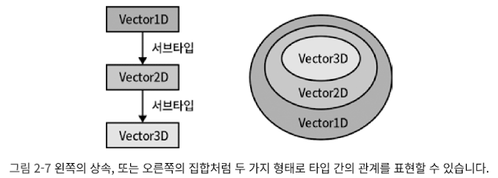

# 아이템 7 타입이 값들의 집합이라고 생각하기

런타임에 모든 변수는 자바스크립트 세상의 값으로부터 정해지는 각자의 고유한 ‘값'을 가진다.
그러나 코드가 실행되기 전, 즉 타입스크립트가 오류를 체크하는 순간에는 ‘타입'을 가지고 있다.
**’할당 가능한 값들의 집합'**이라고 생각하면 좋다.

이 집합은 타입의 ‘범위'라고 부르기도 한다.

> 예를 들어 모든 숫자값의 집합을 number 타입이라고 생각할 수 있다.
strictNullChecks 여부에 따라 null 과 undefined 는 number 에 포함될 수도 아닐 수도 있다.
> 
> 
> ```tsx
> type A = 'A'
> type B = 'B'
> type Twelve = 12
> ```
> 
> 가장 작은 집합은 아무 것도 없는 공집합(never 타입)이며,
> 가장 작은 하나의 값도 타입이 될 수 있다.
> 이러한 값들은 타입스크립트에서 **유닛(unit) 타입**이라고도 불리는 **리터럴(literal) 타입**이다.
> 
> 두개 혹은 세 개로 묶으려면 **유니온(union) 타입**을 사용한다.
> 
> ```tsx
> type AB = 'A' | 'B'
> type AB12 = 'A' | 'B' | 12
> ```
> 
> 유니온 타입은 값 집합들의 합집합을 일컫는다.
> 

⇒ 즉 타입 체커의 역할은 집합의 관점에서 하나의 집합이 다른 집합의 부분 집합인지 검사하는 것이라고 볼 수 있다.

## 인터섹션 타입

---

```tsx
interface Person {
	name: string
}
interface Lifespan {
	birth: Date
	death?: Date
}
type PersonSpan = Person & LifeSpan
```

`&` 연산자는 두 타입의 인터섹션(intersection, 교집합)을 계산한다. 언뜻보면 Person 과 Lifespan 인터페이스는 공통으로 가지는 속성이 없으므로 PersonSpan 타입을 공집합(never 타입)으로 예상할 수 있다.
**그러나 타입 연산자는 인터페이스의 속성이 아닌, 값의 집합(타입의 범위)에 적용된다.
그리고 추가적인 속성을 가지는 값도 여전히 그 타입에 속한다.**

그래서 Person 과 Lifespan 을 둘다 가지는 값은 인터섹션 타입에 속하게 된다.

```tsx
const ps: PersonSpan = {
	name: 'Alan Turing',
	birth: new Date('1912/06/23'),
	death: new Date('1954/06/07'),
} // 정상
```

당연히 앞의 세가지 속성보다 더 많은 속성을 가지는 값도 PersonSpan 타입에 속한다.
**인터섹션 타입의 값은 각 타입 내의 속성을 모두 포함하는 것이 일반적인 규칙이다**

반면 유니온 타입에 대해서는 다르게 작용한다.

```tsx
type K = keyof (Person | Lifespan) // 타입이 never
```

앞의 유니온 타입에 속하는 값은 어떠한 키도 없기 때문에, 유니온에 대한 keyof 는 공집합(never 타입)이어야 한다.
조금더 명확히 써보자면 아래와 같다.

```
keyof (A&B) = (keyof A) | (keyof B)
keyof (A|B) = (keyof A) & (keyof B)
```

## extends 키워드

---

보다 일반적으로는 extends 키워드를 사용한다.

```tsx
interface Person {
	name: string
}
interface PersonSpan extends Person {
	birth: Date
	death?: Date
}
```

‘서브 타입'이라는 용어는 어떤 집합이 다른 집합의 부분집합이라는 의미다.
1차원, 2차원, 3차원 벡터의 관점에서 생각해보면 다음과 같은 코드를 작성할 수 있다.

```tsx
interface Vector1D { x: number }
interface Vector2D extends Vector1D { y: number }
interface Vector3D extends Vector2D { z: number }
```

Vector3D 는 Vector2D 의 서브타입이고, Vector2D 는 Vector1D 의 서브타입이다.
(클래스 관점에서는 ‘서브클래스'가 된다)
보통 이 관계는 상속 관계로 그려지지만, 집합의 관점에서는 벤 다이어그램으로 그리는게 더욱 적절하다.



